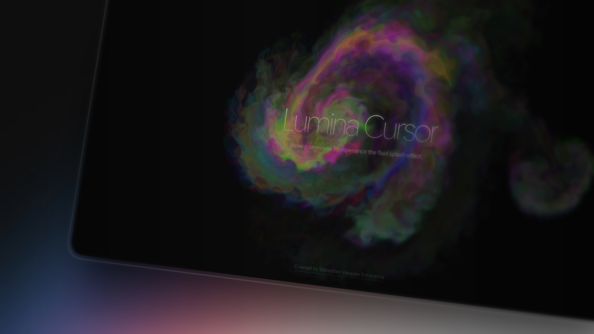

# Lumina Cursor 🌌

A high-performance, interactive fluid simulation and 3D glass cursor effect built with React, WebGL, and React Three Fiber. Experience a fluid, cinematic splash that follows your movement and reacts to your interactions through a refractive glass lens.



## ✨ Features

- **Fluid Dynamics**: High-fidelity fluid simulation using custom WebGL shaders for realistic flow and dissipation.
- **Glass Refraction**: A premium 3D cursor (FluidGlass) that refracts the background in real-time, creating a "glass lens" effect.
- **Interactive Explosions**: Multi-directional color splashes and ripple effects on mouse click.
- **Velocity-Based Physics**: The 3D cursor features "squash and stretch" dynamics that react to movement speed.
- **Shape Shifting**: Toggle between different cursor geometries (Lens, Cube, Star, Torus) on the fly.
- **Optimized Performance**: Capped at 60FPS with balanced resolutions for a silky-smooth experience even on complex scenes.
- **Modern UI**: Minimalist editorial design featuring thin typography and a sophisticated dark aesthetic.

## 🛠️ Tech Stack

- **Framework**: [React 18](https://reactjs.org/)
- **3D Engine**: [React Three Fiber](https://docs.pmnd.rs/react-three-fiber) / [Three.js](https://threejs.org/)
- **Build Tool**: [Vite](https://vitejs.dev/)
- **Styling**: [Tailwind CSS](https://tailwindcss.com/)
- **Graphics**: [WebGL](https://developer.mozilla.org/en-US/docs/Web/API/WebGL_API)
- **Physics**: Custom velocity-based spring physics for the glass cursor.

## 🚀 Getting Started

### Prerequisites

- Node.js (v18 or higher recommended)
- npm, yarn, or pnpm

### Installation

1. Clone the repository:
   ```bash
   git clone https://github.com/sebastianvasquezechavarria1234/lumina-cursor.git
   ```
2. Navigate to the project directory:
   ```bash
   cd lumina-cursor
   ```
3. Install dependencies:
   ```bash
   npm install
   ```

### Running Locally

To start the development server:
```bash
npm run dev
```

The application will be available at `http://localhost:5173`.

## 🎨 Configuration

### Fluid Simulation
You can customize the splash effect in `src/App.jsx` by modifying the `SplashCursor` props:

```jsx
<SplashCursor 
  DYE_RESOLUTION={512}
  PRESSURE_ITERATIONS={24}
  CURL={30}
  SPLAT_RADIUS={0.25}
  RAINBOW_MODE={true}
/>
```

### Glass Cursor
The `FluidGlass` component supports various shapes and refraction intensities. You can adjust its physical properties like friction, tension, and mass to change how it follows the mouse.

## 📁 Project Structure

```text
lumina-cursor/
├── public/              # Static assets (images, icons)
├── src/
│   ├── components/      # React components (SplashCursor, FluidGlass)
│   ├── hooks/           # Custom React hooks for physics and mouse tracking
│   ├── shaders/         # GLSL shader files for fluid simulation
│   ├── App.jsx          # Main application entry point
│   └── main.jsx         # Vite entry point
└── tailwind.config.js   # Style configurations
```

## 🗺️ Roadmap

- [ ] **Custom Textures**: Allow users to upload custom glass textures for the cursor.
- [ ] **Sound Reactive**: Synchronize fluid splashes with audio input.
- [ ] **Multi-Touch Support**: Enable mobile gestures and multi-finger fluid interactions.
- [ ] **Presets Gallery**: A collection of predefined styles (Neon, Ghost, Liquid Gold).

## 📄 License

This project is open source and available under the [MIT License](LICENSE).

---

**Created with ❤️ by [Sebastian Vasquez Echavarria](https://sebas-dev.vercel.app/)**

